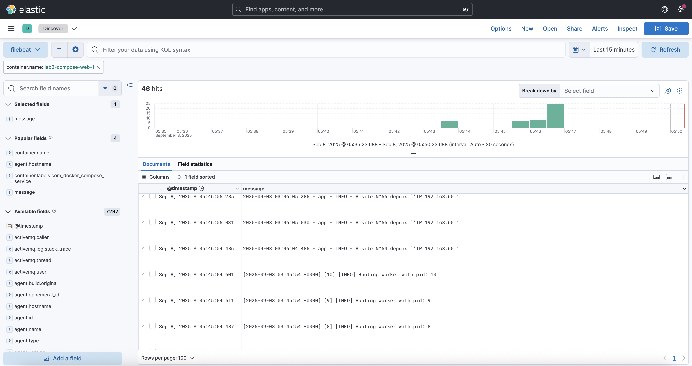

# LAB 5 - Docker Compose : Passage en Production et Monitoring

Dans le Lab 4, nous avons créé un excellent environnement de développement. Cependant, il n'est pas prêt pour la production : la configuration est figée, les secrets ne sont pas gérés, l'image est lourde et nous n'avons aucune visibilité sur les logs. Votre mission est de corriger tout cela.

Nous allons aborder les notions avancées suivantes :

  * **Multi-stage Dockerfile** : Pour créer des images légères et sécurisées.
  * **Fichier `.env`** : Pour gérer la configuration de manière externe.
  * **Docker Secrets** : Pour gérer les mots de passe de manière sécurisée.
  * **Health Checks** : Pour s'assurer que nos services sont bien opérationnels.
  * **Suite ELK** : Pour centraliser et visualiser tous les logs de l'application.

Créer un nouveau répertoire pour ce lab


## Partie 1 : Optimiser l'Application pour la Production

La première étape est de rendre notre image Docker elle-même plus robuste.

**1. Mettre à jour les dépendances (`requirements.txt`)**
Le serveur de développement de Flask n'est pas fait pour la production. Nous allons utiliser **Gunicorn**, un serveur WSGI robuste.

<details><summary>Nouveau requirements.txt</summary>

```
flask
redis
gunicorn
```

</details>

**2. Optimiser le `Dockerfile` (Multi-stage build)**
Nous allons scinder notre `Dockerfile` en deux étapes : une étape de "construction" (`builder`) qui installe les dépendances, et une étape finale, très légère, qui ne contient que notre code et les librairies nécessaires. Cela réduit la taille de l'image et sa surface d'attaque.
* Image du build : `python:3.9`
* Image légère finale : `python:3.9-slim`
* Pour les raison de sécurité, l'utilisateur par défaut sera `nonroot`

<details><summary>Correction Nouveau `Dockerfile`</summary>

```dockerfile
# --- Étape 1: Le "Builder" ---
# On utilise une image Python complète pour installer proprement nos dépendances
FROM python:3.9 as builder

WORKDIR /usr/src/app

# On installe les dépendances dans un environnement virtuel pour les isoler
RUN python -m venv /opt/venv
ENV PATH="/opt/venv/bin:$PATH"

COPY requirements.txt .
RUN pip install --no-cache-dir -r requirements.txt

# --- Étape 2: L'image finale de "Production" ---
# On part d'une image "slim" beaucoup plus légère
FROM python:3.9-slim

# On crée un utilisateur non-root pour des raisons de sécurité
RUN addgroup --system nonroot && adduser --system --ingroup nonroot nonroot
USER nonroot

WORKDIR /home/nonroot/app

# On copie uniquement l'environnement virtuel et le code de l'étape précédente
COPY --from=builder /opt/venv /opt/venv
COPY app.py .

# On expose le port sur lequel Gunicorn va écouter
EXPOSE 8000

# On définit le chemin de l'environnement virtuel pour que les commandes fonctionnent
ENV PATH="/opt/venv/bin:$PATH"

# Commande pour lancer l'application avec Gunicorn (4 workers)
CMD ["gunicorn", "--bind", "0.0.0.0:8000", "--workers", "4", "app:app"]
```

</details>

**3. Mettre à jour l'application (`app.py`) pour les secrets et les logs**

Notre application doit maintenant lire le mot de passe Redis depuis un **Secret Docker** et générer des logs plus clairs pour ELK.

```python
import logging
import time
import redis
from flask import Flask, request

# Configuration du logging standard pour une sortie propre
logging.basicConfig(level=logging.INFO, format='%(asctime)s - %(name)s - %(levelname)s - %(message)s')

app = Flask(__name__)

# --- GESTION DES SECRETS ---
# On lit le mot de passe Redis depuis le fichier monté par Docker Secrets
try:
    with open('/run/secrets/redis_password', 'r') as secret_file:
        redis_password = secret_file.read().strip()
except IOError:
    # Fallback si le secret n'est pas trouvé (pourrait être utile pour un dev local sans secrets)
    redis_password = None

cache = redis.Redis(host='redis', port=6379, password=redis_password)

def get_hit_count():
    retries = 5
    while True:
        try:
            return cache.incr('hits')
        except redis.exceptions.ConnectionError as exc:
            if retries == 0:
                raise exc
            retries -= 1
            time.sleep(0.5)
        except redis.exceptions.ResponseError as exc:
            return f"Erreur d'authentification Redis : {exc}"


@app.route('/')
def hello():
    count = get_hit_count()
    # On log chaque visite avec des informations utiles pour ELK
    app.logger.info(f"Visite N°{count} depuis l'IP {request.remote_addr}")
    return f'Bonjour ! Vous êtes le visiteur numéro {count}.'
```


## Partie 2 : Création d'une Stack de Production avec Docker Compose

Nous allons maintenant construire notre fichier `docker-compose.yml` avancé.

**1. Externaliser la configuration avec un fichier `.env`**

Créez un fichier `.env` à la racine. Docker Compose l'utilisera pour remplacer les variables dans le `docker-compose.yml`.
Mettez-y : 
* Le port du mapping de l'application web sur le Host à `8000`

<details><summary>Corrrection Contenu du fichier `.env`</summary>

```
# Port sur lequel l'application sera exposée sur l'hôte
WEB_PORT=8000
```

</details>

**2. Créer le fichier pour le secret Redis**

```bash
mkdir secrets
echo "MonPassw0rdSuperSecret" > secrets/redis_password.txt
```

**3. Le `docker-compose.yml` avancé avec ELK et Healthchecks**

Créer ce fichier docker-compose qui va définir notre application, et les liens sécurisés entre eux :
* Définir un secret docker-compose du nom de `redis_password`
* La commande de démarrage de Redis est `sh -c "redis-server --requirepass \"$$(cat /run/secrets/redis_password)\""`
* Image de Redis : `redis:6-alpine`
* healthcheck de Redis se fera avec la commande `"redis-cli -a <Mot de passe Redis monté via le Secret> ping"` à interval de 5s, timeout 5s, 3 réessai.

<details><summary>Contenu du `docker-compose.yml`</summary>

```yaml
# Définit le début de la configuration des services de l'application.
services:

  # --- Service Applicatif ---
  web:
    # Indique à Docker Compose de construire une image à partir du Dockerfile
    # présent dans le répertoire courant (.).
    build: .
    
    # Mappe un port sur la machine hôte à un port dans le conteneur.
    # La variable ${WEB_PORT} sera lue depuis un fichier .env à la racine du projet,
    # rendant le port configurable sans modifier ce fichier.
    ports:
      - "${WEB_PORT}:8000"
      
    # Donne à ce conteneur l'accès au secret nommé 'redis_password'.
    # Le secret sera monté comme un fichier dans /run/secrets/redis_password.
    secrets:
      - redis_password
      
    # Définit une dépendance de démarrage. Le service 'web' ne démarrera pas
    # tant que le service 'redis' n'est pas seulement lancé, mais aussi "sain".
    depends_on:
      redis:
        condition: service_healthy

  # --- Service de Base de Données ---
  redis:
    # Utilise une image publique officielle de Redis, basée sur Alpine Linux pour sa légèreté.
    image: "redis:6-alpine"
    
    # Redéfinit la commande de démarrage du conteneur.
    # On utilise un shell (sh -c) pour d'abord lire le contenu du fichier secret
    # (avec `cat`), puis passer ce contenu comme mot de passe à redis-server.
    # Le `$$` est nécessaire pour que Docker Compose ne tente pas d'interpréter `$(cat...)` lui-même.
    command: sh -c "redis-server --requirepass \"$$(cat /run/secrets/redis_password)\""
    
    # Donne également au conteneur Redis l'accès au secret pour qu'il puisse
    # le lire au démarrage.
    secrets:
      - redis_password
      
    # Monte un volume nommé pour la persistance des données.
    # Le dossier /data à l'intérieur du conteneur (où Redis stocke ses données)
    # sera sauvegardé dans le volume 'redis-data' géré par Docker sur la machine hôte.
    volumes:
      - redis-data:/data
      
    # Définit une vérification de santé pour s'assurer que Redis est non seulement démarré,
    # mais qu'il fonctionne correctement et répond aux requêtes.
    healthcheck:
      # La commande de test. Elle utilise un shell pour lire le secret
      # et s'authentifier auprès de Redis avec la commande PING.
      test: ["CMD-SHELL", "redis-cli -a `cat /run/secrets/redis_password` ping"]
      # Docker exécutera ce test toutes les 5 secondes.
      interval: 5s
      # Le test est considéré comme un échec s'il prend plus de 5 secondes.
      timeout: 5s
      # Docker tentera 3 fois avant de marquer le conteneur comme "unhealthy".
      retries: 3

# --- Définitions globales ---

# Section pour déclarer les secrets utilisés dans le fichier.
secrets:
  # Définit un secret nommé 'redis_password'.
  redis_password:
    # Indique à Docker Compose de lire le contenu de ce secret
    # depuis un fichier local.
    file: ./secrets/redis_password.txt

# Section pour déclarer les volumes nommés.
volumes:
  # Définit un volume nommé 'redis-data'. Docker gérera automatiquement
  # la création et le stockage de ce volume sur la machine hôte.
  redis-data:
```

</details>

## Partie 3 : Lancement et Validation

**1. Lancez la stack de production**

Relancer la Stack avec l'option `--build`

Cette option force Docker Compose à reconstruire les images à partir des Dockerfile locaux avant de démarrer les conteneurs. Sans `--build`, si une image avec le même nom existe déjà, Docker Compose la réutilisera sans vérifier si le `Dockerfile` ou le code source a changé.

**/!\Note:** C'est une option cruciale à utiliser lorsque vous avez modifié votre application et que vous voulez être certain de lancer la toute dernière version.

```bash
docker compose up -d --build
```

**2. Vérifiez la santé des services**
Observez l'état des conteneurs. Vous verrez que Redis passe par `starting` puis `healthy` avant que le service `web` ne démarre.

```bash
docker compose ps
```

**3. Générez des logs**

Accédez à **http://localhost:8000** plusieurs fois.

Regarder les logs de vos services 

```bash
docker compose logs web
docker compose logs redis
docker compose logs web -f
```

## Partie 4 : Explorer une Stack ELK Complète avec Docker Compose

### Mise en Situation

Vous êtes un ingénieur DevOps/SRE et votre mission est de mettre en place une solution de centralisation de logs pour l'entreprise. Vous avez trouvé un projet sur GitHub qui déploie une stack complète. Ce laboratoire va vous guider pour déployer cette stack, générer des logs, et suivre leur parcours à travers chaque composant pour comprendre comment ils interagissent.

### Les Composants de la Stack (ELKB)

Cette stack est en réalité une stack **ELKB**, car elle inclut **Beats**, le collecteur de logs.

  * **E - Elasticsearch** : La base de données où tous les logs sont stockés et indexés.
  * **L - Logstash** : Le "pipeline" qui reçoit les logs, peut les transformer/enrichir, et les envoie à Elasticsearch.
  * **K - Kibana** : L'interface web pour explorer, visualiser et analyser les logs stockés dans Elasticsearch.
  * **B - Beats (Filebeat)** : L'agent léger installé sur les machines (ou ici, en tant que conteneur) qui collecte les logs et les envoie à Logstash ou Elasticsearch.

-----

### Partie 4.1 : Préparation et Lancement de la Stack

**1. Clonez le Dépôt Git**
La première étape est de récupérer tous les fichiers de configuration sur votre machine.

```bash
git clone https://github.com/elkninja/elastic-stack-docker-part-one.git
cd elastic-stack-docker-part-one
```

**2. Explorez les Fichiers Clés (Ne lancez rien encore \!)**
Un bon ingénieur lit la documentation avant d'agir. Prenez 2 minutes pour ouvrir ces fichiers :

  * `docker-compose.yml` : Observez les 5 services définis : `elasticsearch`, `logstash`, `kibana`, `filebeat` et `nginx`. Notez comment `filebeat` a accès au socket Docker et au répertoire des logs des conteneurs (`/var/lib/docker/containers`). C'est la clé de la collecte.
  * `filebeat/filebeat.yml` : Regardez la section `filebeat.autodiscover`. Elle est configurée avec un `provider` de type `docker`. C'est ce qui permet à Filebeat de détecter automatiquement les autres conteneurs.
  * `logstash/pipeline/logstash.conf` : Regardez les sections `input` et `output`. Vous verrez qu'il attend des données de `beats` sur le port `5044` et qu'il envoie le résultat (`output`) à `elasticsearch`.

**3. Lancez la Stack Complète**

Maintenant que vous avez une idée de l'architecture, lancez tous les services en arrière-plan.

```bash
docker compose up -d
```

**4. Vérifiez que tout est bien démarré**

Utilisez la commande `ps` pour voir le statut des 5 conteneurs. Ils devraient tous être à l'état `Up` ou `running`. Elasticsearch peut prendre une minute pour démarrer complètement.

```bash
docker compose ps
```

Vous avez désormais 2 stack Compose qui sont en cours de fonctionnement.

**5. Accédez à Kibana**

Accéder à KIbana : http://localhost:5601/

-----

### Partie 4.2 : Le Voyage d'un Log

Nous allons maintenant générer des logs et le suivre à travers les différents composants de la stack.

**1. Générez des Logs**
Le service `web` est notre source de logs. Il expose un site web sur le port 8080.

  * **Action :** Utilisez votre navigateur (ou `curl`) pour visiter le site plusieurs fois. Essayez aussi d'accéder à une page qui n'existe pas pour générer une erreur 404.
  * **Commande :**
    ```bash
    # Appel réussi
    curl http://localhost:8080/
    curl http://localhost:8080/
    # Appel en erreur
    curl http://localhost:8080/cette-page-n-existe-pas
    ```

**2. Étape 1 : La Collecte (Filebeat)**
Filebeat est le premier à voir les logs générés par les conteneur. Il lit le fichier de log du conteneur `web`.

  * **Action :** Regardez les logs de Filebeat. Vous devriez voir des messages indiquant que des "events" sont publiés.
  * **Commande :**
    ```bash
    docker compose logs filebeat
    ```

**3. Étape 2 : Le Traitement (Logstash)**

Pour simplifier le process, Filebeat envoie les logs directement à Elasticsearch sans passer par Logstash.
En principe pour un meilleur parsing (traitement) des logs, on utilise Logstash qui les reçoit, les traite et les prépare pour Elasticsearch.

  * **Action :** Regardez les logs de Logstash. C'est souvent très verbeux, mais vous pouvez y déceler des signes d'activité si vous cherchez bien.
  * **Commande :**
    ```bash
    docker compose logs logstash
    ```

**4. Étape 3 : Le Stockage (Elasticsearch)**

Une fois traités (Dans notre cas, les logs ne sont pas traités par Logstash), les logs sont envoyés et stockés dans Elasticsearch.

  * **Action :** Interrogez directement l'API d'Elasticsearch pour voir si un index a été créé.
  * **Commande :**
    ```bash
    curl -k -X GET -u elastic:changeme "https://localhost:9200/_cat/indices?v"
    # Si vous avez changé de mot de passe dans le fichier .env, adaptez votre requête
    ```
  * **Résultat Attendu :** Vous devriez voir au moins un index avec un nom comme `filebeat-....`. Si la colonne `docs.count` est supérieure à 0, félicitations, vos logs sont bien dans la base de données \!

```bash
curl -k -X GET -u elastic:changeme "https://localhost:9200/_cat/indices?v"
health status index                                           uuid                   pri rep docs.count docs.deleted store.size pri.store.size
yellow open   .ds-.monitoring-es-8-mb-2025.09.08-000001       d0HhoicXSiWmJZ-QBsCDqQ   1   1       1186            0      5.1mb          5.1mb
yellow open   .ds-.monitoring-kibana-8-mb-2025.09.08-000001   l21DbE-WQJyloMBOmc2F_Q   1   1        160            0    373.7kb        373.7kb
green  open   .fleet-file-data-agent-000001                   YLcWqtfIQXW7VH8koPbRkA   1   0          0            0       225b           225b
green  open   .fleet-files-agent-000001                       vWrlFewEQDyDdX59YxEAoA   1   0          0            0       225b           225b
yellow open   .ds-metricbeat-8.7.1-2025.09.08-000001          x2RGMFa5RYawGSqG6sEVXg   1   1      15319            0     14.6mb         14.6mb
yellow open   .ds-.monitoring-logstash-8-mb-2025.09.08-000001 exye0_ZiQNmCRlxXweGK9Q   1   1          1            0     17.4kb         17.4kb
yellow open   .ds-filebeat-8.7.1-2025.09.08-000001            T78_FQw4Sxq_y8yoyoPbUQ   1   1      16684            0      2.8mb          2.8mb
yellow open   logstash-2025.09.08                             e3ORNGV-SPSb8r7aORaJ-g   1   1      16123            0      4.9mb
```

-----

## Partie 4.3 : Visualisation et Analyse dans Kibana

C'est le moment de voir le résultat de notre travail \!

**1. Accédez à Kibana**
Ouvrez votre navigateur et allez sur **http://localhost:5601**. (user: `elastic`, mot de passe : `changeme`)

**2. Créez la "Data View"**
Kibana a besoin de savoir quels index il doit observer.

  * Cliquez sur le menu ☰ en haut à gauche, puis allez dans **Stack Management** \> **Data Views**.
  * Cliquez sur **Create data view**.
  * Dans le champ "Name", donnez-lui un nom (ex: `logs-filebeat`).
  * Dans le champ "Index pattern", tapez `filebeat-*`. Kibana devrait confirmer qu'il trouve des données correspondantes.
  * Pour le "Timestamp field", sélectionnez `@timestamp`.
  * Cliquez sur **Create data view**.

**3. Explorez vos Logs \!**

  * Retournez au menu principal ☰ et cliquez sur **Discover**.
  * **Magie \!** Vous voyez maintenant les logs des conteneurs, (proprement formatés et structurés si les pipelines de traitements sont mis en place; mais ce n'est pas notre but actuellement). Chaque ligne est un document JSON cliquable.

**4. Menez l'enquête**
Maintenant, utilisez la puissance de Kibana pour analyser vos logs :
  * **Filtrer les logs du conteur `web`**
  * Si les traitement via logstash sont implémentés
    * Filtrez les erreurs 404 par exemple. Dans la barre de recherche, quel filtre avez-vous saisi ?
    * Créez une visualisation and Allant dans le menu ☰ \> **Dashboard**. Créez un nouveau dashboard et ajoutez une visualisation (ex: un diagramme circulaire "Pie") pour répartir les requêtes par `response_code`.



## Conclusion

Félicitations \! Vous avez :
* Déployé une application multi-conteneurs résiliente, sécurisée et observable, prête pour la production.
* Déployé une stack ELKB complète, compris le rôle de chaque composant et suivi le parcours d'un log de sa création à sa visualisation.

Vous êtes maintenant prêt à adapter cette architecture pour centraliser les logs de n'importe quelle application conteneurisée.

Pour tout arrêter et nettoyer, retournez dans votre terminal et exécutez :

```bash
docker compose down -v
```