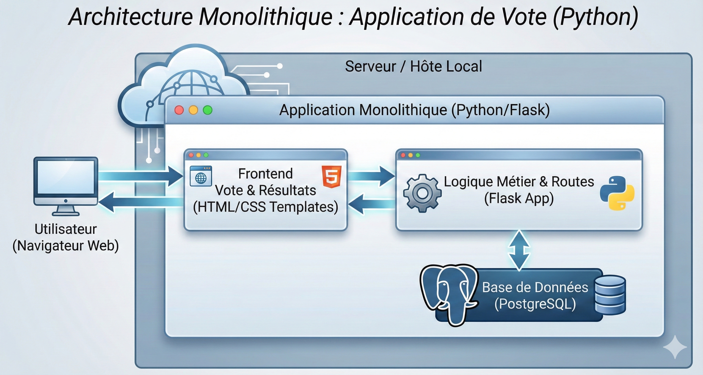
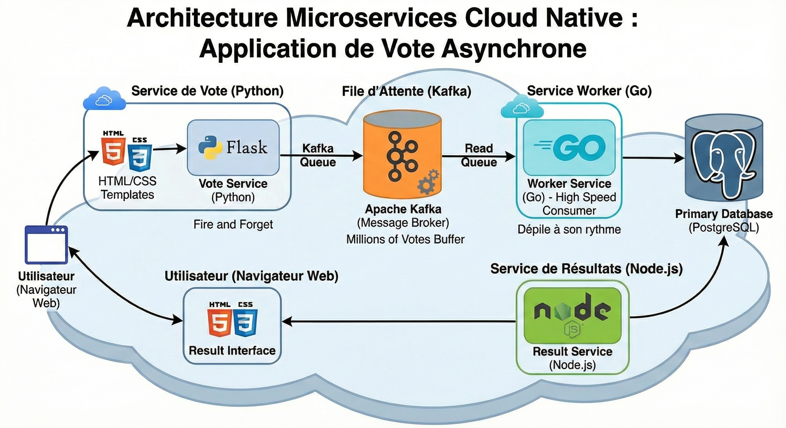

# LAB 6 BONUS - Orchestrer une Application Microservices Complète (Suite)

### Introduction : Pourquoi une architecture microservice ?

Jusqu'à présent, notre Voting App était couplée; typique des applications monolitiques :
- l'application web écrivait directement dans la base de données. Si la base de données ralentissait, l'application web ralentissait aussi (ou plantait).
- Le code Python (Flask) gérait toute la logique (voter, traiter les données, afficher les résultats) et on était contraint d'utiliser le même langage de programation, la même techologie : python/Flask.



Nous allons décomposer l'application en 3 microservices autonomes (la rendre Cloud native) :

1.  **Vote (Python)** : Reçoit le vote et l'envoie immédiatement dans une file d'attente (Kafka). Il ne se soucie pas de la base de données.
2.  **Worker (Go)** : Un petit programme ultra-rapide qui écoute la file d'attente et insère les données dans PostgreSQL quand il a de la ressource.
3.  **Result (Node.js)** : Affiche les résultats depuis PostgreSQL.



**L'avantage de l'Asynchrone (Kafka) :**
C'est le principe du **"Fire and Forget"**. Si des millions de personnes votent en même temps, le service Python accepte tout très vite et Kafka "bufferise" (stocke) les demandes. Le Worker dépilera les votes à son rythme sans faire tomber la base de données. C'est ainsi que fonctionnent Uber, Netflix ou LinkedIn.

-----

## Partie 1 : Le Code des Microservices

Créez un dossier `lab6-microservices` et 3 sous-dossiers : `vote`, `worker`, `result`.

### 1\. Service Vote (Python)

Il reçoit la requête HTTP et publie un message dans Kafka.

**Fichier : `vote/app.py`**

```python
from flask import Flask, render_template_string, request, redirect
from kafka import KafkaProducer
from kafka.errors import NoBrokersAvailable
import json
import os
import time

app = Flask(__name__)

# --- Configuration Kafka & Liens ---
KAFKA_BROKER = os.environ.get('KAFKA_BROKER', 'kafka:9092')
# URL du service de résultat (car il tourne sur un autre port/conteneur maintenant)
RESULT_URL = os.environ.get('RESULT_URL', 'http://localhost:4000')

def get_kafka_producer():
    """Tente de se connecter à Kafka avec un mécanisme de retry"""
    producer = None
    while producer is None:
        try:
            print(f"Tentative de connexion à Kafka ({KAFKA_BROKER})...")
            producer = KafkaProducer(
                bootstrap_servers=[KAFKA_BROKER],
                value_serializer=lambda v: json.dumps(v).encode('utf-8')
            )
            print("Connecté à Kafka !")
        except NoBrokersAvailable:
            print("Kafka n'est pas encore prêt... Nouvelle tentative dans 3 secondes")
            time.sleep(3)
    return producer

# Initialisation du Producer au lancement
producer = get_kafka_producer()

# --- Templates HTML/CSS (Conservés à l'identique) ---
STYLE = """
<style>
    body { font-family: 'Helvetica', sans-serif; background-color: #f4f4f4; text-align: center; padding: 50px; }
    .container { background: white; max-width: 500px; margin: 0 auto; padding: 30px; border-radius: 10px; box-shadow: 0 4px 8px rgba(0,0,0,0.1); }
    h1 { color: #333; }
    button { width: 45%; padding: 15px; font-size: 18px; border: none; cursor: pointer; color: white; border-radius: 5px; margin: 2%; }
    .btn-a { background-color: #1abc9c; } 
    .btn-b { background-color: #3498db; }
    .bar-container { background-color: #ddd; border-radius: 5px; margin: 10px 0; text-align: left; overflow: hidden; }
    .bar { height: 30px; line-height: 30px; color: white; text-align: center; }
    .link { display: block; margin-top: 20px; color: #555; text-decoration: none; }
    .alert { background-color: #dff0d8; color: #3c763d; padding: 10px; border-radius: 5px; margin-bottom: 20px; }
</style>
"""

# J'ai légèrement modifié le template pour accepter l'URL externe des résultats
VOTE_TEMPLATE = """<!DOCTYPE html><html><head><title>Vote</title>""" + STYLE + """</head><body>
    <div class="container">
        <h1>Cats vs Dogs! (Kafka Edition)</h1>
        
        
        <div class="alert">{{ message }}</div>
        

        <form action="/" method="post">
            <button type="submit" name="vote" value="Cats" class="btn-a">🐱 Cats</button>
            <button type="submit" name="vote" value="Dogs" class="btn-b">🐶 Dogs</button>
        </form>
        <a href="{{ result_url }}" class="link">Voir les résultats</a>
    </div>
</body></html>"""

# --- Routes ---

@app.route('/', methods=['GET', 'POST'])
def index():
    message = ""
    
    if request.method == 'POST':
        vote_val = request.form['vote']
        
        # Envoi dans Kafka au lieu de SQL
        try:
            producer.send('votes', {'vote': vote_val})
            message = f"Vote pour {vote_val} envoyé !"
        except Exception as e:
            message = f"Erreur lors de l'envoi : {str(e)}"

    # On reste sur la même page, mais avec un message de confirmation
    return render_template_string(VOTE_TEMPLATE, result_url=RESULT_URL, message=message)

if __name__ == '__main__':
    app.run(debug=True, host='0.0.0.0', port=5000)
```

*Dépendances (`vote/requirements.txt`) :* 

```text
flask
kafka-python
```

### 2\. Service Worker (Go)

Il consomme les messages Kafka et les écrit en BDD.

**Fichier : `worker/main.go`**

```go
package main

import (
    "context"
    "database/sql"
    "encoding/json"
    "fmt"
    "log"
    "os"
    "time" // 1. Import nécessaire pour le sleep

    "github.com/segmentio/kafka-go"
    _ "github.com/lib/pq"
)

type Vote struct {
    Vote string `json:"vote"`
}

func main() {
    // Connexion DB string
    connStr := fmt.Sprintf("host=%s user=%s password=%s dbname=postgres sslmode=disable",
        os.Getenv("DB_HOST"), os.Getenv("DB_USER"), os.Getenv("DB_PASS"))

    var db *sql.DB
    var err error

    // --- 2. BOUCLE DE RÉESSAI (RETRY LOOP) ---
    // On essaie de se connecter pendant 30 secondes max
    fmt.Println("Tentative de connexion à Postgres...")
    for i := 0; i < 15; i++ {
        db, err = sql.Open("postgres", connStr)
        if err == nil {
            // sql.Open ne connecte pas vraiment, Ping le fait
            err = db.Ping()
        }

        if err == nil {
            fmt.Println("Connecté à la base de données avec succès !")
            break
        }

        fmt.Printf("La DB n'est pas prête, nouvelle tentative dans 2s... (%v)\n", err)
        time.Sleep(2 * time.Second)
    }

    if err != nil {
        log.Fatalf("Impossible de se connecter à la DB après plusieurs essais: %v", err)
    }
    // ------------------------------------------

    // Création table
    _, err = db.Exec("CREATE TABLE IF NOT EXISTS votes (id SERIAL PRIMARY KEY, vote TEXT)")
    if err != nil { log.Fatal("Erreur création table:", err) }

    // Connexion Kafka
    // Note: kafka-go gère ses propres reconnexions internes, c'est moins critique ici
    reader := kafka.NewReader(kafka.ReaderConfig{
        Brokers:  []string{os.Getenv("KAFKA_BROKER")},
        Topic:    "votes",
        GroupID:  "worker-group",
        MinBytes: 10e3, // 10KB
        MaxBytes: 10e6, // 10MB
    })

    fmt.Println("Worker démarré, en attente de messages Kafka...")

    for {
        m, err := reader.ReadMessage(context.Background())
        if err != nil {
            log.Printf("Erreur lecture Kafka (retry interne possible): %v", err)
            break 
        }

        var v Vote
        if err := json.Unmarshal(m.Value, &v); err != nil {
            log.Printf("Erreur JSON: %v", err)
            continue
        }

        _, err = db.Exec("INSERT INTO votes (vote) VALUES ($1)", v.Vote)
        if err != nil { log.Printf("Erreur SQL Insert: %v", err) }
        
        fmt.Printf("Vote enregistré: %s\n", v.Vote)
    }
}
```

**Fichier : `worker/go.mod`**

```go
module worker

go 1.23.0

require (
    github.com/klauspost/compress v1.15.9 // indirect
    github.com/lib/pq v1.10.9 // indirect
    github.com/pierrec/lz4/v4 v4.1.15 // indirect
    github.com/segmentio/kafka-go v0.4.49 // indirect
)
```

**Fichier : `worker/go.sum`**

```go
github.com/klauspost/compress v1.15.9 h1:wKRjX6JRtDdrE9qwa4b/Cip7ACOshUI4smpCQanqjSY=
github.com/klauspost/compress v1.15.9/go.mod h1:PhcZ0MbTNciWF3rruxRgKxI5NkcHHrHUDtV4Yw2GlzU=
github.com/lib/pq v1.10.9 h1:YXG7RB+JIjhP29X+OtkiDnYaXQwpS4JEWq7dtCCRUEw=
github.com/lib/pq v1.10.9/go.mod h1:AlVN5x4E4T544tWzH6hKfbfQvm3HdbOxrmggDNAPY9o=
github.com/pierrec/lz4/v4 v4.1.15 h1:MO0/ucJhngq7299dKLwIMtgTfbkoSPF6AoMYDd8Q4q0=
github.com/pierrec/lz4/v4 v4.1.15/go.mod h1:gZWDp/Ze/IJXGXf23ltt2EXimqmTUXEy0GFuRQyBid4=
github.com/segmentio/kafka-go v0.4.49 h1:GJiNX1d/g+kG6ljyJEoi9++PUMdXGAxb7JGPiDCuNmk=
github.com/segmentio/kafka-go v0.4.49/go.mod h1:Y1gn60kzLEEaW28YshXyk2+VCUKbJ3Qr6DrnT3i4+9E=
```

### 3\. Service Result (Node.js)

Il lit simplement la base de données.

**Fichier : `result/server.js`**

```javascript
const express = require('express');
const { Pool } = require('pg');
const app = express();

const pool = new Pool({
  user: process.env.DB_USER || 'postgres',
  host: process.env.DB_HOST || 'db',
  database: 'postgres',
  password: process.env.DB_PASS || 'password',
  port: 5432,
});

// URL du service de vote pour le bouton "Retour"
// Par défaut 5002 car c'est le port externe défini dans votre docker-compose
const VOTE_URL = process.env.VOTE_URL || 'http://localhost:5002';

app.get('/', async (req, res) => {
  try {
    // 1. Récupération des données
    const catsResult = await pool.query("SELECT count(*) FROM votes WHERE vote='Cats'");
    const dogsResult = await pool.query("SELECT count(*) FROM votes WHERE vote='Dogs'");

    // 2. Traitement (Postgres renvoie des strings pour les COUNT, il faut convertir)
    const cats = parseInt(catsResult.rows[0].count);
    const dogs = parseInt(dogsResult.rows[0].count);
    const total = cats + dogs;

    // 3. Calcul des pourcentages (avec protection contre la division par zéro)
    const catsPct = total > 0 ? (cats / total * 100).toFixed(1) : "0.0";
    const dogsPct = total > 0 ? (dogs / total * 100).toFixed(1) : "0.0";

    // 4. Construction du Template HTML (Template String)
    // C'est le même CSS que votre version Python
    const html = `
    <!DOCTYPE html>
    <html>
    <head>
        <title>Résultats</title>
        <style>
            body { font-family: 'Helvetica', sans-serif; background-color: #f4f4f4; text-align: center; padding: 50px; }
            .container { background: white; max-width: 500px; margin: 0 auto; padding: 30px; border-radius: 10px; box-shadow: 0 4px 8px rgba(0,0,0,0.1); }
            h1 { color: #333; }
            .bar-container { background-color: #ddd; border-radius: 5px; margin: 10px 0; text-align: left; overflow: hidden; }
            .bar { height: 30px; line-height: 30px; color: white; text-align: center; }
            .btn-a { background-color: #1abc9c; } 
            .btn-b { background-color: #3498db; }
            .link { display: block; margin-top: 20px; color: #555; text-decoration: none; }
        </style>
    </head>
    <body>
        <div class="container">
            <h1>Résultats! (Kafka Edition)</h1>
            
            <h3>🐱 Cats : ${cats} (${catsPct}%)</h3>
            <div class="bar-container">
                <div class="bar btn-a" style="width: ${catsPct}%;"></div>
            </div>
            
            <h3>🐶 Dogs : ${dogs} (${dogsPct}%)</h3>
            <div class="bar-container">
                <div class="bar btn-b" style="width: ${dogsPct}%;"></div>
            </div>
            
            <p>Total: ${total}</p>
            
            <a href="${VOTE_URL}" class="link">Retour au vote</a>
        </div>
    </body>
    </html>
    `;

    res.send(html);

  } catch (err) {
    console.error(err);
    res.status(500).send("Erreur lors de la récupération des résultats: " + err.toString());
  }
});

app.listen(4000, () => {
  console.log('Result app listening on port 4000');
});
```

**Fichier : `result/package.json`**

```json
{
  "name": "result-server",
  "version": "1.0.0",
  "main": "server.js",
  "scripts": {
    "start": "node server.js"
  },
  "dependencies": {
    "express": "^4.18.2",
    "pg": "^8.11.3"
  }
}
```

-----

## Partie 2 : Dockerfiles

Créez un `Dockerfile` dans chaque sous-dossier.

**1. `vote/Dockerfile`**

```dockerfile
FROM python:3.9-slim
WORKDIR /app
COPY requirements.txt .
RUN pip install -r requirements.txt
COPY . .
CMD ["python", "app.py"]
```

**2. `worker/Dockerfile`**

```dockerfile
# Build stage
# Utilisation de la version 1.23 pour matcher une version Go réaliste
FROM golang:1.23-alpine AS builder
WORKDIR /app
COPY . .
# CGO_ENABLED=0 est crucial pour créer un binaire statique portable sur alpine
RUN go mod tidy && CGO_ENABLED=0 go build -o worker .
# Run stage
FROM alpine:latest
WORKDIR /root/
COPY --from=builder /app/worker .
CMD ["./worker"]
```

**3. `result/Dockerfile`**

```dockerfile
FROM node:18-alpine
WORKDIR /app
COPY package*.json ./
RUN npm install
COPY . .
CMD ["node", "server.js"]
```

-----

## Partie 3 : Test Local et Push Registre

### 1\. Test avec Docker Compose

Avant d'aller sur Kubernetes, on valide que le puzzle s'assemble.

Créez `docker-compose.yml` à la racine :

```yaml
services:
  zookeeper:
    image: confluentinc/cp-zookeeper:7.4.4  # REMPLACÉ latest par 7.4.4
    environment:
      ZOOKEEPER_CLIENT_PORT: 2181
      ZOOKEEPER_TICK_TIME: 2000 # Souvent nécessaire

  kafka:
    image: confluentinc/cp-kafka:7.4.4      # REMPLACÉ latest par 7.4.4
    depends_on: [zookeeper]
    ports:
      - "9092:9092" # Optionnel : pratique pour debugger depuis votre machine
    environment:
      KAFKA_BROKER_ID: 1                        # AJOUTÉ : Requis en mode Zookeeper
      KAFKA_ZOOKEEPER_CONNECT: zookeeper:2181
      KAFKA_ADVERTISED_LISTENERS: PLAINTEXT://kafka:9092
      KAFKA_LISTENER_SECURITY_PROTOCOL_MAP: PLAINTEXT:PLAINTEXT # AJOUTÉ : Bonne pratique
      KAFKA_OFFSETS_TOPIC_REPLICATION_FACTOR: 1
      KAFKA_TRANSACTION_STATE_LOG_MIN_ISR: 1    # AJOUTÉ : Évite des erreurs sur un seul noeud
      KAFKA_TRANSACTION_STATE_LOG_REPLICATION_FACTOR: 1

  db:
    image: postgres:13-alpine
    environment:
      POSTGRES_PASSWORD: password

  vote:
    build: ./vote
    ports: ["5000:5000"]
    depends_on: [kafka]
    environment:
      KAFKA_BROKER: kafka:9092
      RESULT_URL: http://localhost:4000  # URL publique pour que le navigateur accède aux résultats

  worker:
    build: ./worker
    depends_on: [kafka, db]
    environment:
      KAFKA_BROKER: kafka:9092
      DB_HOST: db
      DB_USER: postgres
      DB_PASS: password

  result:
    build: ./result
    ports: ["4000:4000"]
    environment:
      DB_HOST: db
      DB_PASS: password
      # On indique l'URL publique du service de vote
      VOTE_URL: http://localhost:5000
```

**Testez :** `docker compose up --build`. Accédez à `localhost:5000` (vote) et `localhost:4000` (résultat).

### 2\. Push vers le Registre Harbor

En entreprise, nous ne déployons pas depuis notre PC. Nous envoyons nos images dans un **Registre** sécurisé.

> **Note Entreprise :** Normalement, vous ne tapez pas ces commandes. C'est un pipeline **GitLab CI** qui détecte votre `git push`, lance les tests, build les images Docker et les pousse automatiquement. Ici, nous le faisons manuellement pour comprendre.

Connectez vous à [https://harbor.mpakoupete.com](https://harbor.mpakoupete.com) puis créez un repository publique du nom de `<votre-prenom>-formation` (ex: `mawaki-formation`)

```bash
# 1. Login au registre
docker login harbor.mpakoupete.com

# 2. Build et Tag des images
docker build -t harbor.mpakoupete.com/<votre-prenom>-formation/vote:v1 ./vote
docker build -t harbor.mpakoupete.com/<votre-prenom>-formation/worker:v1 ./worker
docker build -t harbor.mpakoupete.com/<votre-prenom>-formation/result:v1 ./result

# 3. Push
docker push harbor.mpakoupete.com/<votre-prenom>-formation/vote:v1
docker push harbor.mpakoupete.com/<votre-prenom>-formation/worker:v1
docker push harbor.mpakoupete.com/<votre-prenom>-formation/result:v1
```